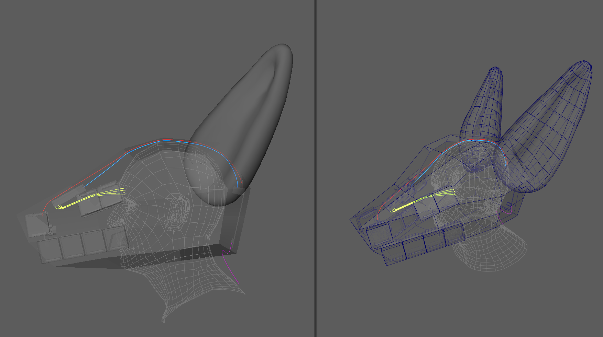
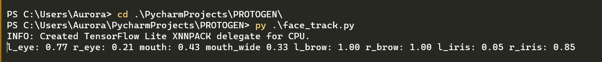

# PROTOGEN

🏳️‍🌈 🏳️‍⚧️ Trans Rights are Human Rights 🏳️‍⚧️ 🏳️‍🌈

//
[Introduction](#what-is-this-repo) //
[Installing](#installing-and-running) //

# What is this repo?
This is a repo for me to test out a collection of markerless facial tracking stuff, as well 
as controlling LED panels like a Raspi Pico Unicorn HAT

The end goal is to create my own Protogen mask for 3d printing, and use a Raspi (or Raspi-like alternative) to run 
    facial tracking real-time inside the mask, which will then affect the LED panels on the outside to show facial 
    poses on the mask.

3D Model blockout: \
`cabling: (pink: USBC from power bank (not in the head, thats a fire risk I dont want to have right next to my face), Red for an IR cam over usb to the raspi, Blue is a usb cable from the raspi to the raspi pico, and Yellow is GPIO from the pico controlling the led panels)`

Terminal Output:


# Installing and Running
To get this whole project, run these terminal commands
```
pip install opencv-python mediapipe Pillow serial numpy 
git clone https://github.com/CatAndDogSoup/PROTOGEN.git
cd PROTOGEN
python face_track.py
```
